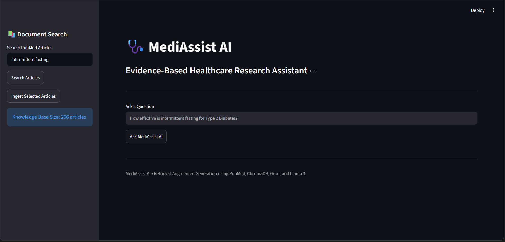
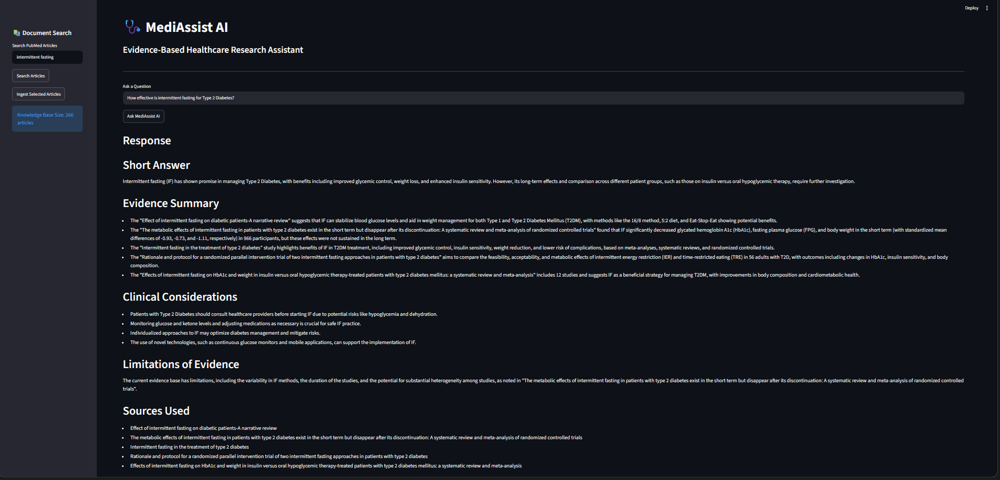

# 🩺 MediAssist AI

<p align="center">


</p>

<p align="center">
  <b>Evidence-Based Healthcare Research Assistant using Retrieval-Augmented Generation (RAG)</b>
</p>

<a href="https://mediassist-ai-snp.streamlit.app/">Try the App</a>

---

# 📌 Overview

MediAssist AI is an intelligent healthcare research assistant designed to help clinicians, researchers, and healthcare professionals quickly access evidence-based insights from PubMed literature.

The system leverages:

- 🔍 PubMed article retrieval
- 🧠 Retrieval-Augmented Generation (RAG)
- 📚 ChromaDB Vector Database
- 🤖 Llama 3 Models (Groq & Ollama)
- 🌐 Streamlit User Interface

to generate concise, context-aware, evidence-based responses to healthcare-related questions.

---

# 🚀 Problem Statement

Healthcare professionals often face:

- Information overload from rapidly growing medical literature
- Conflicting research findings
- Lack of consensus across studies
- Time constraints when reviewing evidence

MediAssist AI addresses these challenges by retrieving relevant PubMed articles and synthesizing them into structured clinical summaries.

---

# ✨ Features

### 📄 PubMed Literature Retrieval

- Search medical literature using PubMed
- Retrieve relevant research articles
- Store article metadata and abstracts

### 📚 Vector Database

- ChromaDB-powered vector storage
- Semantic search using embeddings
- Efficient retrieval of relevant documents

### 🤖 Dual LLM Support

#### Groq Backend

- Llama 3.3 70B Versatile
- Fast cloud inference
- Production-ready performance

#### Ollama Backend

- Local deployment
- Offline inference
- Privacy-focused usage

### 🩺 Evidence-Based Responses

Generated answers include:

- Short Answer
- Evidence Summary
- Clinical Considerations
- Limitations of Evidence
- Sources Used

### 🌐 Streamlit Interface

- Search PubMed articles
- Select articles for ingestion
- Ask natural language questions
- View structured healthcare responses

---

# 🏗️ System Architecture

```text
                    ┌──────────────────┐
                    │     PubMed       │
                    └────────┬─────────┘
                             │
                             ▼
                  ┌────────────────────┐
                  │ Article Retrieval  │
                  └────────┬───────────┘
                           │
                           ▼
                  ┌────────────────────┐
                  │     ChromaDB       │
                  │  Vector Database   │
                  └────────┬───────────┘
                           │
                           ▼
                  ┌────────────────────┐
                  │ Semantic Retrieval │
                  └────────┬───────────┘
                           │
                           ▼
                  ┌────────────────────┐
                  │  Context Builder   │
                  └────────┬───────────┘
                           │
                           ▼
        ┌──────────────────┴──────────────────┐
        │                                     │
        ▼                                     ▼
 ┌───────────────┐                   ┌───────────────┐
 │ Ollama Llama3 │                   │ Groq Llama3.3 │
 └───────┬───────┘                   └───────┬───────┘
         │                                   │
         └──────────────┬────────────────────┘
                        ▼
              ┌──────────────────┐
              │ Evidence-Based   │
              │ Healthcare Q&A   │
              └──────────────────┘
```

---

# 🛠️ Tech Stack

| Component | Technology |
|------------|------------|
| Frontend | Streamlit |
| Backend | Python |
| Vector Database | ChromaDB |
| Embeddings | all-MiniLM-L6-v2 |
| Cloud LLM | Groq Llama 3.3 70B |
| Local LLM | Ollama Llama 3 |
| Research Source | PubMed |
| Environment Management | Python Dotenv |

---

# 📂 Project Structure

```text
W7&8/
│
├── app.py
├── requirements.txt
├── README.md
├── .gitignore
│
├── data/
│   └── pubmed_articles.json
│
├── notebooks/
│
├── src/
│   ├── article_search.py
│   ├── chroma_manager.py
│   ├── config.py
│   ├── llm.py
│   ├── groq_llm.py
│   ├── pubmed.py
│   ├── rag_pipeline.py
│   └── rag_pipeline_groq.py
```

---

# ⚙️ Installation

## Clone Repository

```bash
git clone https://github.com/snp-007/mediassist-ai.git

cd mediassist-ai
```

## Create Virtual Environment

```bash
python -m venv venv
```

### Activate Environment

Windows

```bash
venv\Scripts\activate
```

Linux/Mac

```bash
source venv/bin/activate
```

## Install Dependencies

```bash
pip install -r requirements.txt
```

---

# 🔑 Environment Variables

Create a `.env` file:

```env
GROQ_API_KEY=your_groq_api_key
```

---

# ▶️ Running the Application

```bash
streamlit run app.py
```

---

# 💻 Using Groq Backend

The Streamlit app currently uses:

```python
from rag_pipeline_groq import RAGPipeline
```

Advantages:

- Faster inference
- Better response quality
- No local GPU requirements

---

# 🏠 Using Ollama Backend

Install Ollama:

```bash
https://ollama.com/
```

Run:

```bash
ollama run llama3
```

Switch:

```python
from rag_pipeline import RAGPipeline
```

Advantages:

- Fully offline
- No API costs
- Enhanced privacy

---

# 🔍 Sample Questions

```text
How effective is intermittent fasting for Type 2 Diabetes?

What are the risks of intermittent fasting in diabetic patients?

Can intermittent fasting help with obesity?

Which intermittent fasting methods are most studied?

What evidence supports intermittent fasting for metabolic syndrome?
```

---

# 📊 Example Output

```text
Short Answer

Evidence Summary

Clinical Considerations

Limitations of Evidence

Sources Used
```

---

# 📸 Application Screenshots

### Home Page

</img>

```text
screenshots/homepage.png
```

### Generated Response

</img>

```text
screenshots/response.png
```

---

# 🔮 Future Enhancements

- Citation-aware RAG
- Direct PubMed URL linking
- PDF ingestion support
- Multi-disease support
- Clinical guideline integration
- User authentication
- Medical report summarization

---

# 👨‍💻 Author

### Siba Narayana Parida

- NIT Rourkela
- Machine Learning & Data Science Enthusiast

### Connect

[LinkedIn](https://linkedin.com)

[GitHub](https://github.com)

---

# ⭐ If you found this project useful

Please consider giving it a star!

```bash
⭐ Star this repository
```

---

# 📜 License

This project is licensed under the MIT License.
